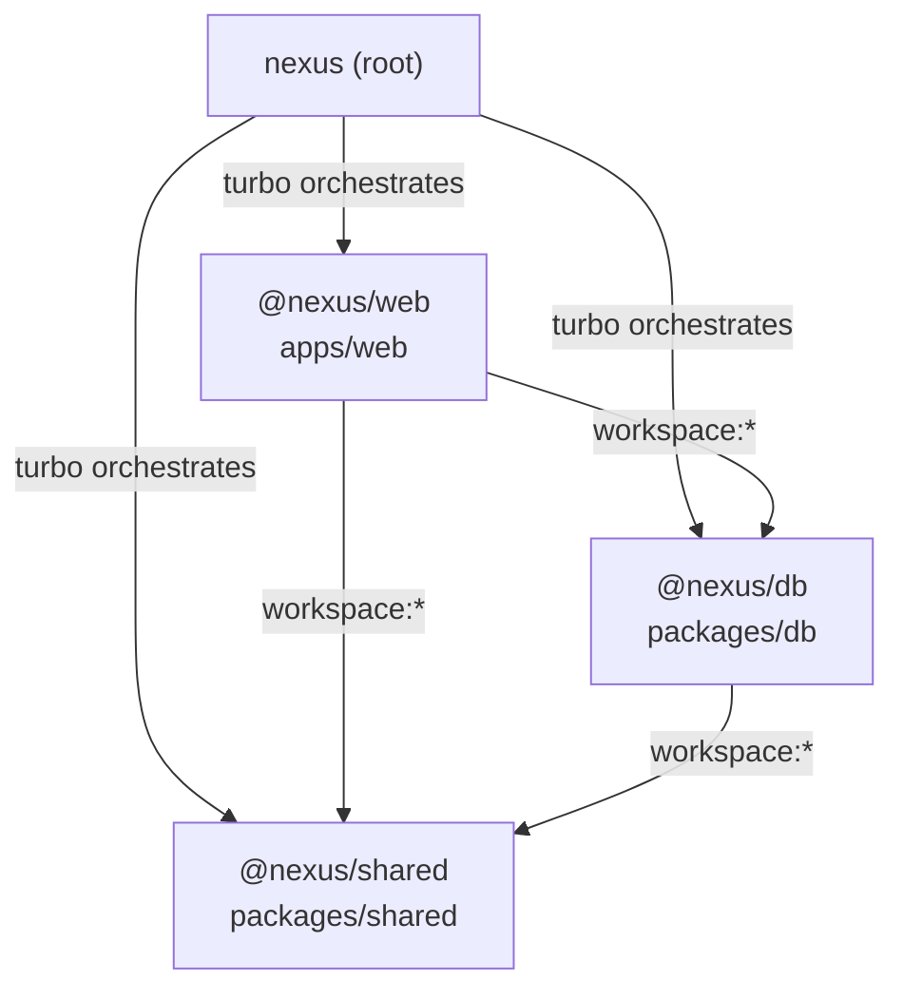

# Phase 1: Structural Reconnaissance

**Audit Date:** 2026-04-13
**Auditor:** Claude (automated)
**Mode:** READ ONLY — no source files modified

---

## Section 1: Monorepo Structure

### 1a. Packages and Dependencies

The monorepo uses **Turborepo** (`turbo@^2.5.0`) with **pnpm** (`pnpm@10.33.0`) workspaces.

**pnpm-workspace.yaml** defines two workspace globs:
```
packages:
  - "apps/*"
  - "packages/*"
```

**Three packages exist (excluding `.next` build artifact):**

| Package | Name | Type | Key Dependencies |
|---------|------|------|------------------|
| `./package.json` | `nexus` (root) | Workspace root | turbo, typescript |
| `apps/web/package.json` | `@nexus/web` | Next.js 14 app | @nexus/db, @nexus/shared, @anthropic-ai/sdk, rivetkit, drizzle-orm |
| `packages/db/package.json` | `@nexus/db` | Database schema + seeds | @nexus/shared, drizzle-orm, postgres |
| `packages/shared/package.json` | `@nexus/shared` | Shared types | (none — typescript only) |

**Dependency graph:**



**Build pipeline (turbo.json):**

| Task | dependsOn | Outputs | Cache |
|------|-----------|---------|-------|
| `build` | `^build` (topological) | `.next/**`, `dist/**` | Yes |
| `dev` | — | — | No (persistent) |
| `lint` | `^build` | — | Yes |
| `db:generate` | — | — | No |
| `db:push` | — | — | No |
| `db:seed` | — | — | No |

**Global env vars in turbo.json:** `DATABASE_URL`, `DIRECT_URL`
**Build-time env vars:** `DATABASE_URL`, `DIRECT_URL`, `NEXT_PUBLIC_SUPABASE_URL`, `NEXT_PUBLIC_SUPABASE_ANON_KEY`, `ANTHROPIC_API_KEY`

**Root pnpm override:** `drizzle-orm: ^0.39.0` (forces consistent version across workspace)

### 1b. Route Map

#### Page Routes (17 total)

**Landing:**

| Route | File | Description |
|-------|------|-------------|
| `/` | `apps/web/src/app/page.tsx` | Landing page (outside dashboard layout) |

**Dashboard (route group `(dashboard)/`):**

| Route | File | Feature Area |
|-------|------|-------------|
| `/command-center` | `(dashboard)/command-center/page.tsx` | Pipeline overview |
| `/pipeline` | `(dashboard)/pipeline/page.tsx` | Deal pipeline views |
| `/pipeline/[id]` | `(dashboard)/pipeline/[id]/page.tsx` | Deal detail workspace |
| `/book` | `(dashboard)/book/page.tsx` | Post-close account management |
| `/deal-fitness` | `(dashboard)/deal-fitness/page.tsx` | Deal fitness analytics |
| `/intelligence` | `(dashboard)/intelligence/page.tsx` | Patterns, field feed, close intel |
| `/playbook` | `(dashboard)/playbook/page.tsx` | Experiments, influence |
| `/outreach` | `(dashboard)/outreach/page.tsx` | Email sequences |
| `/agent-config` | `(dashboard)/agent-config/page.tsx` | Agent NL configuration |
| `/agent-admin` | `(dashboard)/agent-admin/page.tsx` | Agent admin (purpose unclear — not in sidebar) |
| `/analytics` | `(dashboard)/analytics/page.tsx` | Pipeline metrics (not in sidebar) |
| `/analyze` | `(dashboard)/analyze/page.tsx` | Streaming call analyzer (not in sidebar) |
| `/calls` | `(dashboard)/calls/page.tsx` | Transcript library (not in sidebar) |
| `/observations` | `(dashboard)/observations/page.tsx` | Redirects to intelligence?tab=feed |
| `/prospects` | `(dashboard)/prospects/page.tsx` | Contact database (not in sidebar) |
| `/team` | `(dashboard)/team/page.tsx` | Team roster (not in sidebar) |

#### API Routes (35 total)

**Core Data:**

| Route | Methods | Feature |
|-------|---------|---------|
| `/api/deals` | GET | All deals with joins |
| `/api/deals/stage` | POST | Update deal stage |
| `/api/deals/resolve` | POST | Resolve deal from name fragment |
| `/api/deals/close-analysis` | POST | AI close/loss analysis |
| `/api/deals/[id]/meddpicc` | GET | MEDDPICC data for deal |
| `/api/deals/[id]/meddpicc-update` | PATCH | Persist MEDDPICC scores |
| `/api/deals/[id]/update` | PATCH | Generic deal field update |
| `/api/companies` | GET | All companies |
| `/api/team-members` | GET | All team members |
| `/api/activities` | GET | Recent activities |
| `/api/notifications` | GET | Notifications by member |

**Agent / AI:**

| Route | Methods | maxDuration | Feature |
|-------|---------|-------------|---------|
| `/api/agent/call-prep` | POST | 120s | Generate call brief |
| `/api/agent/configure` | POST, PUT | — | Interpret/save agent config |
| `/api/agent/draft-email` | POST | 60s | Generate email |
| `/api/agent/feedback` | POST | — | Feedback request |
| `/api/agent/save-to-deal` | POST | — | Save agent action as activity |
| `/api/analyze` | POST | 60s | Stream transcript analysis |
| `/api/analyze/link` | POST | — | Save analysis as activity |

**Observations / Intelligence:**

| Route | Methods | maxDuration | Feature |
|-------|---------|-------------|---------|
| `/api/observations` | GET, POST | 30s | List/create observations |
| `/api/observations/[id]/follow-up` | POST | — | Follow-up processing |
| `/api/observations/clusters` | GET | — | Observation clusters |
| `/api/observation-routing` | GET, PATCH | — | Routing records |
| `/api/intelligence/agent-patterns` | GET | 30s | Cross-deal patterns |

**Field Queries:**

| Route | Methods | maxDuration | Feature |
|-------|---------|-------------|---------|
| `/api/field-queries` | GET, POST | 30s | Field queries |
| `/api/field-queries/respond` | POST | 30s | Process response |
| `/api/field-queries/suggestions` | GET | — | Suggested questions |

**Post-Sale / Customer:**

| Route | Methods | maxDuration | Feature |
|-------|---------|-------------|---------|
| `/api/book` | GET | — | AE's book of accounts |
| `/api/customer/response-kit` | POST | 60s | Generate response kit |
| `/api/customer/qbr-prep` | POST | 60s | Generate QBR agenda |
| `/api/customer/outreach-email` | POST | 60s | Outreach email generation |

**Deal Fitness:**

| Route | Methods | Feature |
|-------|---------|---------|
| `/api/deal-fitness` | GET | Portfolio + single-deal fitness |

**Playbook:**

| Route | Methods | Feature |
|-------|---------|---------|
| `/api/playbook/ideas/[id]` | PATCH | Update experiment status |

**Infrastructure:**

| Route | Methods | maxDuration | Feature |
|-------|---------|-------------|---------|
| `/api/rivet/[...all]` | ALL | 300s | Rivet actor handler |
| `/api/transcript-pipeline` | POST | 300s | Trigger transcript pipeline |
| `/api/demo/reset` | POST | 300s | Reset demo data |

### 1c. Directory Tree

```
nexus/
├── apps/
│   └── web/                          # Next.js 14 application
│       ├── public/
│       │   └── demo-transcripts/     # Static transcript files for demo
│       └── src/
│           ├── actors/               # Rivet actor definitions (3 actors)
│           ├── app/
│           │   ├── (dashboard)/      # Dashboard route group (16 pages)
│           │   └── api/              # API routes (35 endpoints)
│           ├── components/           # Shared UI components
│           │   ├── analyzer/         # Call analysis display components (9 files)
│           │   ├── feedback/         # Agent feedback components
│           │   └── layout/           # Sidebar, top bar
│           └── lib/                  # DB connection, utilities
│               └── analysis/         # Analysis helper modules
├── demo-transcripts/                 # Additional demo transcripts (root-level)
├── docs/
│   ├── audit/                        # Audit output files (this document)
│   └── diagrams/                     # Architecture diagrams
├── packages/
│   ├── db/                           # Database package
│   │   ├── drizzle/                  # Generated migration SQL files
│   │   └── src/
│   │       ├── schema.ts             # 33+ tables, enums, relations
│   │       ├── index.ts              # Re-exports
│   │       ├── seed.ts               # Main seed orchestrator
│   │       ├── seed-*.ts             # 18 topic-specific seed scripts
│   │       ├── seed-data/            # Extracted seed data (playbook evidence, experiments)
│   │       └── seeds/                # Additional seeds (healthfirst transcript)
│   └── shared/                       # Shared types
│       └── src/
│           └── types.ts              # Role types, stage labels
└── .claude/                          # Claude Code configuration
    └── specs/                        # Specs (completed, in-progress, plans)
```

---

## Section 2: Entry Points and Configuration

### 2a. Application Root Layout

**File:** `apps/web/src/app/layout.tsx`

The root layout is minimal — it provides only:
- HTML `<html lang="en">` and `<body>` wrapper
- Global CSS import (`globals.css`)
- Metadata: title "Nexus — AI Sales Orchestration"

**No providers at root level.** No RivetProvider, no ThemeProvider, no error boundaries.

### Dashboard Layout

**File:** `apps/web/src/app/(dashboard)/layout.tsx`

The dashboard layout wraps all non-landing pages and provides:
1. **`PersonaProvider`** — the only global state provider. Wraps all dashboard content. Fetches `teamMembers` and `supportFunctionMembers` from DB at render time (server component, `force-dynamic`). Persona persisted to `localStorage`.
2. **`Sidebar`** — navigation
3. **`TopBar`** — header with user switcher
4. **`LayoutAgentBar`** — agent bar placement
5. **`DemoGuide`** — floating guided demo checklist

**No RivetProvider** is used at the layout level. Rivet actors are accessed directly via the `useActor` hook from `@/lib/rivet`, which creates its own connection per hook instance.

### 2b. Database Connection

**File:** `apps/web/src/lib/db.ts`

```typescript
import { drizzle } from "drizzle-orm/postgres-js";
import postgres from "postgres";
import * as schema from "@nexus/db";

const connectionString = process.env.DATABASE_URL!;
const client = postgres(connectionString, { prepare: false });
export const db = drizzle(client, { schema });
```

- Uses `postgres` (postgres.js) driver with `prepare: false` (required for Supabase pooled connections)
- Connection string from `DATABASE_URL` environment variable
- Schema imported from `@nexus/db` package
- Single shared `db` instance exported (module-level singleton)

**Drizzle config** (`packages/db/drizzle.config.ts`):
- Uses `DIRECT_URL` (not pooled) for migrations
- Loads `.env` from workspace root (`../../.env`)
- Schema path: `./src/schema.ts`
- Output: `./drizzle`

### 2c. Rivet Handler

**File:** `apps/web/src/app/api/rivet/[...all]/route.ts`

```typescript
import { toNextHandler } from "@rivetkit/next-js";
import { registry } from "@/actors/registry";

export const maxDuration = 300;

export const { GET, POST, PUT, PATCH, DELETE, HEAD, OPTIONS } = toNextHandler(registry);
```

- Catch-all route handles all HTTP methods
- `toNextHandler` from `@rivetkit/next-js` bridges Rivet to Next.js API routes
- `maxDuration = 300` (5 minutes — maximum Vercel allows on Pro plan)
- Registry defined in `apps/web/src/actors/registry.ts`:

```typescript
import { setup } from "rivetkit";
import { dealAgent } from "./deal-agent";
import { transcriptPipeline } from "./transcript-pipeline";
import { intelligenceCoordinator } from "./intelligence-coordinator";

export const registry = setup({
  use: { dealAgent, transcriptPipeline, intelligenceCoordinator },
});
```

**Three registered actors:** `dealAgent`, `transcriptPipeline`, `intelligenceCoordinator`

**Client-side Rivet access** (`apps/web/src/lib/rivet.ts`):
- `createRivetKit<Registry>()` from `@rivetkit/react`
- Endpoint resolution: `NEXT_PUBLIC_RIVET_ENDPOINT` → `window.location.origin/api/rivet` (browser) → `NEXT_PUBLIC_SITE_URL/api/rivet` (SSR) → `http://localhost:3001/api/rivet` (fallback)

### 2d. Anthropic SDK Initialization Points

Every Claude API call uses model string `claude-sonnet-4-20250514`. There are **13 files** with Anthropic client initialization:

**API Routes (11 files) — using `@anthropic-ai/sdk`:**

| File | Initialization Pattern | API Key Source |
|------|----------------------|----------------|
| `api/deals/close-analysis/route.ts` | `new Anthropic()` | Auto (`ANTHROPIC_API_KEY`) |
| `api/agent/configure/route.ts` | `new Anthropic({ apiKey })` | Explicit from `process.env.ANTHROPIC_API_KEY` |
| `api/agent/draft-email/route.ts` | `new Anthropic()` | Auto |
| `api/agent/call-prep/route.ts` | `new Anthropic()` | Auto |
| `api/field-queries/route.ts` | `new Anthropic({ apiKey })` | Explicit (3 instances in file) |
| `api/field-queries/respond/route.ts` | `new Anthropic({ apiKey })` | Explicit (2 instances) |
| `api/analyze/route.ts` | `new Anthropic({ apiKey })` | Explicit |
| `api/observations/route.ts` | `new Anthropic({ apiKey })` | Explicit (2 instances) |
| `api/customer/outreach-email/route.ts` | `new Anthropic()` | Auto (module-level) |
| `api/customer/qbr-prep/route.ts` | `new Anthropic()` | Auto (module-level) |
| `api/customer/response-kit/route.ts` | `new Anthropic()` | Auto (inside handler) |

**Actors (2 files) — using raw `fetch` to Anthropic REST API:**

| File | Pattern | API Key Source |
|------|---------|----------------|
| `actors/transcript-pipeline.ts` | `fetch("https://api.anthropic.com/v1/messages", ...)` | `process.env.ANTHROPIC_API_KEY` |
| `actors/intelligence-coordinator.ts` | `fetch("https://api.anthropic.com/v1/messages", ...)` | `process.env.ANTHROPIC_API_KEY` |

**Note:** The actors use raw `fetch` instead of the `@anthropic-ai/sdk`. This is likely because actor code runs in the Rivet runtime where the SDK may not be available or bundled. Both actors set `anthropic-version: "2023-06-01"` header manually.

**Inconsistency flag:** Some routes explicitly pass `apiKey` to the constructor while others rely on auto-detection from `ANTHROPIC_API_KEY`. Both patterns work but the inconsistency suggests organic growth rather than a unified pattern.

---

## Section 3: Environment Variables

| Variable | Used In | Purpose | Required |
|----------|---------|---------|----------|
| `DATABASE_URL` | `apps/web/src/lib/db.ts`, turbo.json | PostgreSQL connection string (pooled, Supabase) | Yes |
| `DIRECT_URL` | `packages/db/drizzle.config.ts`, turbo.json | PostgreSQL direct connection (for migrations) | Yes (for migrations) |
| `ANTHROPIC_API_KEY` | 11 API routes + 2 actors | Claude API authentication | Yes |
| `NEXT_PUBLIC_SITE_URL` | `lib/rivet.ts`, `api/agent/call-prep`, `api/demo/reset`, `api/intelligence/agent-patterns`, `api/transcript-pipeline`, `deal-fitness/page.tsx` | Absolute URL for SSR/server Rivet client and internal API calls | Yes (production) |
| `NEXT_PUBLIC_APP_URL` | `api/analyze/link`, `api/transcript-pipeline`, `deal-fitness/page.tsx` | Alternative to NEXT_PUBLIC_SITE_URL (fallback) | No |
| `NEXT_PUBLIC_RIVET_ENDPOINT` | `lib/rivet.ts` | Override Rivet endpoint for client-side | No |
| `RIVET_ENDPOINT` | `api/agent/call-prep`, `api/demo/reset`, `api/intelligence/agent-patterns`, `api/transcript-pipeline` | Rivet Cloud internal endpoint (production) | No (falls back to NEXT_PUBLIC_SITE_URL) |
| `NEXT_PUBLIC_SUPABASE_URL` | turbo.json (build env) | Supabase project URL | UNVERIFIED — referenced in turbo.json but no grep hits in source |
| `NEXT_PUBLIC_SUPABASE_ANON_KEY` | turbo.json (build env) | Supabase anonymous key | UNVERIFIED — same as above |
| `VERCEL_URL` | `api/analyze/link`, `api/transcript-pipeline` | Auto-set by Vercel, used as fallback for site URL | No (auto-set) |
| `PORT` | `api/agent/call-prep`, `api/demo/reset`, `api/intelligence/agent-patterns`, `api/transcript-pipeline` | Dev server port (fallback: 3001) | No |

**Environment files found (contents NOT read for security):**
- `/.env` — root-level env file
- `/.env.local` — root-level local overrides
- `/apps/web/.env` — web app env file

**No `.env.example` found** — this is a gap for developer onboarding.

**Red flag:** `NEXT_PUBLIC_SUPABASE_URL` and `NEXT_PUBLIC_SUPABASE_ANON_KEY` are listed in turbo.json's build env but do not appear in any source file. They may be vestigial from an earlier architecture or used by a Supabase client that was later removed.

---

## Section 4: Dependency Inventory

### apps/web (Non-trivial dependencies)

| Package | Version | Purpose |
|---------|---------|---------|
| `@anthropic-ai/sdk` | `^0.80.0` | Claude API client for all AI features |
| `@nexus/db` | `workspace:*` | Internal DB schema package |
| `@nexus/shared` | `workspace:*` | Internal shared types |
| `@rivetkit/next-js` | `^2.2.0` | Next.js integration for Rivet actors |
| `@rivetkit/react` | `^2.2.0` | React hooks for Rivet actor state |
| `rivetkit` | `^2.2.0` | Rivet actor runtime (stateful AI agents) |
| `@radix-ui/react-*` | `^1.1.0–^2.1.0` | Headless UI primitives (9 packages: avatar, dialog, dropdown-menu, popover, select, separator, slot, tabs, tooltip) |
| `@tremor/react` | `^3.18.0` | Dashboard chart/visualization components |
| `class-variance-authority` | `^0.7.0` | Component variant utility (shadcn pattern) |
| `clsx` | `^2.1.0` | Conditional className utility |
| `drizzle-orm` | `^0.39.0` | Type-safe ORM for PostgreSQL |
| `lucide-react` | `^0.468.0` | Icon library |
| `next` | `14.2.29` | Next.js framework (App Router) |
| `postgres` | `^3.4.0` | PostgreSQL driver (postgres.js) |
| `tailwind-merge` | `^2.6.0` | Tailwind class conflict resolution |
| `tailwindcss-animate` | `^1.0.7` | Tailwind animation utilities |

### packages/db

| Package | Version | Purpose |
|---------|---------|---------|
| `drizzle-orm` | `^0.39.0` | ORM (schema definitions) |
| `postgres` | `^3.4.0` | PostgreSQL driver |
| `drizzle-kit` | `^0.30.0` | Migration generation/push (devDep) |
| `tsx` | `^4.19.0` | TypeScript execution for seed scripts (devDep) |
| `dotenv` | `^16.4.0` | Env file loading for seed/migration scripts (devDep) |

### packages/shared

No runtime dependencies. TypeScript only.

---

## Section 5: Build and Deployment

### Next.js Configuration

**File:** `apps/web/next.config.mjs`

```javascript
const nextConfig = {
  transpilePackages: ["@nexus/db", "@nexus/shared"],
  serverExternalPackages: ["rivetkit", "@rivetkit/next-js"],
};
```

- `transpilePackages`: workspace packages compiled by Next.js (since they export raw `.ts`)
- `serverExternalPackages`: Rivet packages excluded from webpack bundling (required for Rivet's native modules)
- **No custom webpack config**, no rewrites, no redirects, no headers
- **No `output: 'standalone'`** — uses default Vercel deployment

### maxDuration Settings

15 API routes set explicit `maxDuration`:

| Duration | Routes |
|----------|--------|
| 300s (5m) | `rivet/[...all]`, `transcript-pipeline`, `demo/reset` |
| 120s (2m) | `agent/call-prep` |
| 60s (1m) | `deals/close-analysis`, `agent/draft-email`, `analyze`, `customer/outreach-email`, `customer/qbr-prep`, `customer/response-kit` |
| 30s | `intelligence/agent-patterns`, `field-queries`, `field-queries/respond`, `observations` |
| 15s | `deals/[id]/meddpicc-update` |

**20 routes have no explicit maxDuration** and default to Vercel's 10s (Hobby) or 15s (Pro) limit. These are all lightweight CRUD/read routes.

### Vercel Configuration

- **No `vercel.json` found** — uses default Vercel settings
- **No `middleware.ts` found** — no edge middleware
- Deployment: auto-deploy from `main` branch (per CLAUDE.md)
- Live URL: `nexus-web-plum-iota.vercel.app`

### Seed Scripts

**20 seed files** in `packages/db/src/`:

| File | Purpose |
|------|---------|
| `seed.ts` | Main orchestrator |
| `seed-org.ts` | Team members, companies, contacts, deals |
| `seed-agents.ts` | Agent configurations |
| `seed-agent-actions.ts` | Agent action log entries |
| `seed-book.ts` | Post-sale accounts (18 companies, health, messages, articles) |
| `seed-close-analysis.ts` | Close/loss analysis data |
| `seed-cross-feedback.ts` | Cross-agent feedback |
| `seed-deal-fitness.ts` | Deal fitness events and scores (Horizon Health) |
| `seed-field-queries.ts` | Field queries + questions |
| `seed-final-polish.ts` | Final data adjustments |
| `seed-hero-activities.ts` | Key activity entries |
| `seed-intelligence.ts` | Intelligence data |
| `seed-intelligence-fixes.ts` | Intelligence data patches |
| `seed-observations.ts` | Observation records |
| `seed-outreach.ts` | Email sequences |
| `seed-playbook.ts` | Playbook experiments |
| `seed-playbook-lifecycle.ts` | Experiment lifecycle data |
| `seed-system-intelligence.ts` | System intelligence patterns |
| `seed-transcripts-resources.ts` | Call transcripts and resources |
| `seeds/seed-healthfirst-transcript.ts` | HealthFirst cross-deal transcript |

---

## Section 6: Summary Statistics

| Metric | Count |
|--------|-------|
| `.tsx` files (apps/web) | 56 |
| `.ts` files (apps/web) | 48 |
| API route files | 35 |
| Page routes | 17 |
| Monorepo packages | 3 (`@nexus/web`, `@nexus/db`, `@nexus/shared`) |
| Rivet actors | 3 (`dealAgent`, `transcriptPipeline`, `intelligenceCoordinator`) |
| Anthropic SDK init files | 13 (11 API routes + 2 actors) |
| Model string used | `claude-sonnet-4-20250514` (uniform across all 13 files) |
| Environment variables | 11 unique |
| Seed scripts | 20 |
| maxDuration-configured routes | 15 |
| shadcn/Radix UI primitives | 9 |

---

## Phase 1 Summary for Subsequent Phases

### Totals
- **Packages:** 3 (`@nexus/web`, `@nexus/db`, `@nexus/shared`)
- **Page routes:** 17 (1 landing + 16 dashboard)
- **API routes:** 35
- **Environment variables:** 11 unique (3 required: `DATABASE_URL`, `DIRECT_URL`, `ANTHROPIC_API_KEY`)
- **Anthropic SDK initialization points:** 13 files (11 use SDK, 2 use raw fetch)
- **Rivet actor files:** 4 (3 actors + 1 registry)
- **Total source files:** 104 (56 .tsx + 48 .ts in apps/web)

### Red Flags
1. **Vestigial env vars:** `NEXT_PUBLIC_SUPABASE_URL` and `NEXT_PUBLIC_SUPABASE_ANON_KEY` are declared in turbo.json build env but not referenced in any source file. May indicate removed Supabase client code that was not fully cleaned up.
2. **Inconsistent Anthropic client pattern:** Some routes explicitly pass `apiKey` to `new Anthropic({ apiKey })` after manually reading `process.env.ANTHROPIC_API_KEY`, while others use `new Anthropic()` which auto-reads the env var. Both work but the split suggests no enforced pattern.
3. **Actors bypass SDK:** `transcript-pipeline.ts` and `intelligence-coordinator.ts` call the Anthropic REST API via raw `fetch` instead of using `@anthropic-ai/sdk`. This means they don't benefit from SDK retry logic, type safety, or streaming helpers.
4. **No `.env.example`:** No template env file exists for developer onboarding.
5. **No middleware:** No `middleware.ts` — the app has no auth, rate limiting, or edge-level routing. This is noted as intentional (demo app, persona switching only).
6. **No error boundary:** Root layout has no React error boundary. Dashboard layout has no error boundary.
7. **Module-level Anthropic clients:** `customer/outreach-email` and `customer/qbr-prep` create `new Anthropic()` at module scope (outside handler). This means the client is created once when the module loads and reused across requests — generally fine but worth noting.
8. **`agent-admin` page:** Listed in the filesystem but not documented in CLAUDE.md's dashboard pages table. Purpose unclear.

### Files Phase 2 (Database Schema Audit) Should Read First
1. `packages/db/src/schema.ts` — all table definitions, enums, relations
2. `packages/db/src/index.ts` — exports (verify what is exposed)
3. `packages/db/drizzle.config.ts` — migration configuration
4. `packages/db/drizzle/` — all migration SQL files (verify schema matches migrations)
5. `apps/web/src/lib/db.ts` — connection setup, schema import
6. `packages/shared/src/types.ts` — shared type definitions used alongside schema
7. `packages/db/src/seed.ts` — main seed orchestrator (reveals table insertion order / FK dependencies)
