# 04B — Prompt Dependency Graph

Per DECISIONS.md 2.15, this is the third of the four-session prompt analysis phase (4.5a → 4.5b → **4.6** → 4.7). Having audited every prompt's text (04A-PROMPT-AUDIT.md) and every prompt's context inputs (07A-CONTEXT-AUDIT.md), this document maps the full dependency graph across all 25 prompts — which prompts consume which other prompts' outputs, how quality propagates, and in what order rewrites should land.

**How to read this document:**
- **Section 1** — text-form dependency entry per prompt (upstream / downstream / triggering / data bridges).
- **Section 2** — visual dependency map (Mermaid flowchart grouped into 5 functional clusters).
- **Section 3** — blast radius ranking with a transparent scoring formula.
- **Section 4** — recommended rewrite order for Prompt 4.7's Top 8.
- **Section 5** — cluster-level observations (merge / split / missing prompts).
- **Section 6** — dependency health findings (broken edges, missing edges, shape drift).
- **Section 7** — v2 graph projection (how DECISIONS.md architecture reshapes the graph).

**Dependency edge conventions used throughout:**
- **Direct** — prompt B consumes prompt A's output within the same request/flow (in-memory handoff, no persistence boundary).
- **Transitive** — prompt B reads prompt A's output from persisted state (a later request, possibly days later).
- **Surface** — a user-facing route/page/modal renders the prompt's output directly.

---

## Section 1: Dependency Graph (Text Form)

### #1 Observation Classification

- **Upstream prompts:** None. Runs on raw rep input. Pipeline #21 provides a BYPASS path (`preClassified: true` short-circuits this call) but doesn't feed it data.
- **Downstream consumers:**
  - Direct: **#2** Cluster Semantic Match (consumes `primarySignalType`); **#3** New Cluster Detection (fall-through when #2 misses); **#4** Agent Config Change Suggestion (fires when `signal.type ∈ {agent_tuning, cross_agent}`).
  - Transitive: **#11** Call Prep (reads `observations` rows during deal context assembly); **#14** Close Analysis (reads `observations` for the deal); **#8** Deal-Scoped Q&A (reads `observations` for the deal); **#6** Field Query Analysis (reads recent observations).
- **Triggering events:** `POST /api/observations` when a rep types in the Universal Agent Bar, or when pipeline-generated signals arrive with `preClassified: false`. Also triggered from MCP `log_observation` tool.
- **Data bridges:** writes `observations.ai_classification`, `.ai_giveback`, `.extracted_entities`, `.cluster_id` (via #2), `.linked_account_ids`, `.linked_deal_ids`. Downstream prompts (#11/#14/#8) read `observations` table directly; #4 triggered inline.

### #2 Cluster Semantic Match

- **Upstream prompts:** **#1** (supplies raw input + primary signal type).
- **Downstream consumers:** None direct. Cluster assignment persists to `observations.cluster_id`; Intelligence Patterns tab renders clusters.
- **Triggering events:** Inline after #1 completes, in same `POST /api/observations` request.
- **Data bridges:** writes `observations.cluster_id` + appends to `observation_clusters.unstructured_quotes` jsonb + increments `observation_count`/`observer_count`/`last_observed`. Fall-through to #3 if confidence < 0.6.

### #3 New Cluster Detection

- **Upstream prompts:** **#1** (raw input + signal type), **#2** (fall-through on no-match).
- **Downstream consumers:** None direct. Creates new `observation_clusters` rows consumed by future **#2** runs.
- **Triggering events:** Inline after #2 fall-through.
- **Data bridges:** inserts `observation_clusters` row; updates matched unclustered `observations` to point at the new cluster.

### #4 Agent Config Change Suggestion

- **Upstream prompts:** **#1** (fires when signal type is `agent_tuning` or `cross_agent`). Pipeline #21 was INTENDED to feed this too but the 7-vs-9 enum drift (04A Cross-Cutting anti-pattern #3; 04-PROMPTS Inconsistencies) means pipeline-detected signals never carry these types.
- **Downstream consumers:**
  - Transitive: **#11** Call Prep (reads mutated `agent_configs.instructions` + `output_preferences`); **#12** Email Draft (same); **#13** NL Config Interpretation (same — when user issues NL instruction, current config is what #4 has mutated).
- **Triggering events:** Inline when #1 classifies an observation with `agent_tuning` or `cross_agent` signal. Per `applyAgentChange()`.
- **Data bridges:** writes `agent_configs.instructions` (append-only), `.output_preferences` (shallow-merge), `agent_config_versions` (new row, `changedBy: 'feedback_loop'`), and `notifications` (to target member). Per DECISIONS.md 2.25 #3 v2 converts this to an event-sourced proposal.

### #5 Streaming Transcript Analysis

- **Upstream prompts:** None. Pasted transcript input only.
- **Downstream consumers:** None. When saved via `/api/analyze/link`, output lands in `activities.metadata` for a deal but no other prompt reads it.
- **Triggering events:** `POST /api/analyze` (user pastes transcript on `/analyze` page). Streams via SSE.
- **Data bridges:** optionally writes `activities` row (`type='note_added'`, `metadata.source='call_analysis'`) with full analysis JSON in `metadata`.

### #6 Field Query Analysis (Org-Wide)

- **Upstream prompts:** None. Manager's raw question + assembled cluster/observation/deal context.
- **Downstream consumers:**
  - Direct: **#7** Personalized AE Question Generator (when fanout path — one #7 invocation per targeted AE, up to 8 per query).
  - Transitive: **#9** (via AE response → give-back), **#10** (via aggregated responses).
- **Triggering events:** `POST /api/field-queries` with `scope: 'org_wide'` (manager submits question with no dealId).
- **Data bridges:** writes `field_queries.ai_analysis` jsonb. If `can_answer_now && confidence='high'`, writes `aggregated_answer.summary` directly (no fanout). Otherwise `needs_input_from.deal_ids` seeds #7's per-AE loop.

### #7 Personalized AE Question Generator

- **Upstream prompts:** **#6** (consumes `data_gap` + deal IDs to target).
- **Downstream consumers:**
  - Direct: **#9** Give-Back Insight (reads the question + the AE's response).
  - Transitive: **#10** Aggregated Answer Synthesis (reads answered responses across all AEs).
- **Triggering events:** In loop inside `POST /api/field-queries` fanout path — one call per targeted AE.
- **Data bridges:** inserts `field_query_questions` row per AE (question_text, chips, target_member_id, deal_id).

### #8 Deal-Scoped Manager Question Answer

- **Upstream prompts:** None. Reads deal context fresh from DB.
- **Downstream consumers:**
  - Direct: None (the deal-scoped path's follow-up fires HARDCODED chips, not a Claude call).
- **Triggering events:** `POST /api/field-queries` with a resolved `dealId` (deal-scoped branch).
- **Data bridges:** writes `field_queries.aggregated_answer.summary` (plain text + sentinel line). If `NEEDS_AE_INPUT: true`, creates one `field_query_questions` row for the deal's AE with hardcoded chips.

### #9 Give-Back Insight

- **Upstream prompts:** **#7** (consumes the question + the AE's response).
- **Downstream consumers:** None.
- **Triggering events:** `POST /api/field-queries/respond` after AE submits a chip response.
- **Data bridges:** writes `field_query_questions.give_back` jsonb. Rendered in Quick Check UI.

### #10 Aggregated Answer Synthesis

- **Upstream prompts:** **#7** (indirectly — the questions whose responses are being aggregated). Also **#6** transitively (the original question is part of input).
- **Downstream consumers:** None.
- **Triggering events:** `POST /api/field-queries/respond` when enough `field_query_questions` are `status='answered'` (threshold logic in route handler).
- **Data bridges:** writes `field_queries.aggregated_answer.summary` (prose). Flips query `status='answered'`.

### #11 Call Prep Brief Generator

- **Upstream prompts (transitive via DB/state):**
  - **#20** Score MEDDPICC (via `meddpicc_fields` table).
  - **#22** Synthesize Learnings (via `deal_agent_states.learnings`).
  - **#15** Deal Fitness Analysis (via `deal_fitness_events` + `deal_fitness_scores`).
  - **#25** Coordinator Synthesis (via `deal_agent_states.coordinated_intel` — **BROKEN** per 07-DATA-FLOWS Flow 6; should be via `coordinator_patterns` per DECISIONS.md 2.17 LOCKED).
  - **#14** Close Analysis (via `deals.close_factors`/`win_factors` + `close_notes` of closed deals in same vertical).
  - **#21** Detect Signals (via `observations` for this deal).
  - **#4** Agent Config Change (via `agent_configs`).
  - **#23** Experiment Attribution (via `playbook_ideas.current_metrics` — surfaces graduated experiments as proven plays).
- **Downstream consumers:** None. Terminal prompt.
- **Triggering events:** Three paths — (a) manual "Prep Call" button on deal detail, (b) post-pipeline auto-fire (browser polls `briefPending` flag per Flow 2), (c) MCP tool `generate_call_prep`.
- **Data bridges:** reads ~14 tables inline; does NOT write persistently. "Save to Deal" fires separate `POST /api/agent/save-to-deal` which writes an `activities` row with the full brief in `metadata`.

### #12 Email Draft Generator

- **Upstream prompts (transitive):**
  - **#5** and **#21** indirectly via `call_analyses.summary`/`painPoints`/`nextSteps` (when `type='follow_up'`).
  - **#4** via mutated `agent_configs` (voice).
  - **#22** via `deal_agent_states` (not consumed structurally today but context-audit-ready).
- **Downstream consumers:** None.
- **Triggering events:** `POST /api/agent/draft-email` from Universal Agent Bar "Draft email" command.
- **Data bridges:** `POST /api/agent/save-to-deal` writes `activities` row (`type='email_draft'`) when rep clicks Save.

### #13 NL Agent Config Interpretation

- **Upstream prompts:**
  - Transitive: **#4** Agent Config Change (when user opens the config editor, "current config" shown is whatever #4 has auto-mutated — #13 interprets changes against that state).
- **Downstream consumers:**
  - Transitive: **#4** (future runs read the user-confirmed config); **#11**, **#12** (all read mutated `agent_configs`).
- **Triggering events:** `POST /api/agent/configure` (user types NL instruction on `/agent-config` page).
- **Data bridges:** returns structured proposal to client; user confirms → separate PUT writes `agent_configs` + `agent_config_versions`.

### #14 Close Analysis (Win/Loss)

- **Upstream prompts (transitive via DB):**
  - **#20** via `meddpicc_fields`.
  - **#5** / **#21** via `call_transcripts` ⨝ `call_analyses` (analyses + painPoints + competitiveMentions + nextSteps).
  - **#21** additionally via `observations` for this deal.
  - **#25** SHOULD consume but doesn't today (per 07A §14 — no coordinator patterns in close-lost context).
  - **#22** SHOULD consume but doesn't today (no deal-agent learnings in close-lost context).
- **Downstream consumers:**
  - Transitive: **#11** Call Prep reads `deals.close_factors`/`win_factors`/`close_notes`/`win_turning_point` as Win/Loss Intelligence for future deals in the same vertical.
- **Triggering events:** User picks Closed Won / Closed Lost in `StageChangeModal`; `POST /api/deals/close-analysis` fires automatically.
- **Data bridges:** writes `deals.close_ai_analysis`, `.close_factors`, `.win_factors`, `.close_notes`, `.win_turning_point`, `.win_replicable`; creates one `observations` row per confirmed factor; writes `dealStageHistory`; creates `stage_changed` activity.

### #15 Deal Fitness Analysis

- **Upstream prompts:** None (reads `call_transcripts.transcript_text` + email activities directly, not via any other prompt's output).
- **Downstream consumers:**
  - Transitive: **#11** Call Prep reads `deal_fitness_events` + `deal_fitness_scores` (via the inline fitness-context section).
- **Triggering events:** `POST /api/deal-fitness/analyze` — fired post-pipeline by the browser (`workflowProgress.finalize.complete`), or manually from the `/deal-fitness` page, or via pipeline's analyze-deal-fitness step.
- **Data bridges:** delete-then-insert 25 rows in `deal_fitness_events`; upsert `deal_fitness_scores` (per-category + overall + jsonb narratives).

### #16 Customer Response Kit

- **Upstream prompts:** None.
- **Downstream consumers:** None.
- **Triggering events:** `POST /api/customer/response-kit` (AE opens response kit modal for an inbound `customer_messages` row, or bulk-runs per pending message).
- **Data bridges:** writes `customer_messages.response_kit` jsonb; flips `status='kit_ready'`; sets `ai_category`.

### #17 QBR Agenda Generator

- **Upstream prompts:** None.
- **Downstream consumers:** None.
- **Triggering events:** `POST /api/customer/qbr-prep` (AE selects QBR type in My Book drawer).
- **Data bridges:** returns to client; not persisted.

### #18 Customer Outreach Email

- **Upstream prompts:** None.
- **Downstream consumers:** None.
- **Triggering events:** `POST /api/customer/outreach-email` (AE selects outreach purpose OR proactive-signal action in My Book drawer).
- **Data bridges:** returns to client; not persisted.

### #19 Pipeline Step — Extract Actions (Actor)

- **Upstream prompts:** None (transcript input from pipeline enqueue).
- **Downstream consumers:**
  - Direct: **#22** Synthesize Learnings (consumes `JSON.stringify(actions)`); **#24** Pipeline Draft Follow-Up Email (consumes actions).
  - Transitive: **#11** via `deal_agent_states.lastInteractionSummary` which references action items.
- **Triggering events:** Pipeline step 2 (`parallel-analysis`) — one of three parallel Claude calls.
- **Data bridges:** in-memory on `loopCtx.state.actionItems`. Persisted transitively via #22 → `deal_agent_states.learnings` and via the `deal-agent-state` summary.

### #20 Pipeline Step — Score MEDDPICC (Actor)

- **Upstream prompts:** None (transcript input).
- **Downstream consumers:**
  - Transitive: **#8** (reads `meddpicc_fields`); **#11** (reads `meddpicc_fields`); **#14** (reads `meddpicc_fields`); **#15** (should but doesn't today per 07A §15). MCP tools `get_deal_details`, UI MEDDPICC tab, Intelligence dashboard aggregations all read same table.
- **Triggering events:** Pipeline step 2 (`parallel-analysis`) — parallel with #19/#21.
- **Data bridges:** PATCH `/api/deals/[id]/meddpicc-update` writes `meddpicc_fields` (upsert per dimension) + creates delta-audit `activities` row.

### #21 Pipeline Step — Detect Signals (Actor)

- **Upstream prompts:** None (transcript input).
- **Downstream consumers:**
  - Direct: **#22** (consumes `signals.signals` + `stakeholderInsights`); **#24** (consumes stakeholder names); **#25** Coordinator (signals sent via `receiveSignal` RPC).
  - Direct-via-bypass: **#1** Observation Classification is BYPASSED for pipeline-created observations (`preClassified: true` short-circuits #1).
  - Transitive: **#11** (reads resulting `observations` for the deal); **#14** (reads `observations`); **#4** SHOULD fire via `agent_tuning`/`cross_agent` signals but enum drift prevents this.
- **Triggering events:** Pipeline step 2 (`parallel-analysis`) — parallel with #19/#20.
- **Data bridges:** in-memory `loopCtx.state.signals` + `stakeholderInsights`. Later step `create-signal-observations` inserts one `observations` row per signal (via `POST /api/observations` with `preClassified=true`). Also sent to coordinator actor.

### #22 Pipeline Step — Synthesize Learnings (Actor)

- **Upstream prompts:**
  - Direct: **#19** (actions via JSON.stringify); **#20** (MEDDPICC updates via JSON.stringify); **#21** (signals + stakeholderInsights via JSON.stringify).
- **Downstream consumers:**
  - Transitive: **#11** (reads `deal_agent_states.learnings` via `formatMemoryForPrompt` in call prep).
- **Triggering events:** Pipeline step 5 (`synthesize-learnings`), after parallel-analysis completes.
- **Data bridges:** merged into `deal_agent_states.learnings` jsonb (string array).

### #23 Pipeline Step — Experiment Attribution (Actor, Conditional)

- **Upstream prompts:** None (transcript + experiments list).
- **Downstream consumers:**
  - Transitive: **#11** via `playbook_ideas.experiment_evidence` (evidence accumulation → graduation → proven plays surfaced in call prep's proven-plays section).
- **Triggering events:** Pipeline step 6 (`check-experiments`) — only fires if AE is in `test_group` of at least one `status='testing'` experiment.
- **Data bridges:** PATCH `/api/playbook/ideas/[id]` appends to `experiment_evidence` jsonb.

### #24 Pipeline Step — Draft Follow-Up Email (Actor)

- **Upstream prompts:**
  - Direct: **#19** (actions); **#21** (stakeholder names).
- **Downstream consumers:** None (rendered in workflow tracker; not persisted unless rep saves — but no save UX currently wires from pipeline output).
- **Triggering events:** Pipeline step 7 (`draft-email`), after synthesize-learnings.
- **Data bridges:** in-memory `loopCtx.state.followUpEmail`. Wrapped in try/catch — pipeline continues on failure.

### #25 Coordinator Pattern Synthesis (Actor)

- **Upstream prompts:**
  - Direct: **#21** (signals sent to coordinator via `receiveSignal` RPC). Coordinator accumulates 2+ signals of same type + same vertical (+ same competitor for competitive_intel) before firing this prompt.
- **Downstream consumers:**
  - SHOULD consume: **#11** Call Prep via `deal_agent_states.coordinated_intel` (BROKEN per Flow 6 — `addCoordinatedIntel()` is a no-op). Per DECISIONS.md 2.17 LOCKED, v2 fixes this by having call prep query `coordinator_patterns` directly.
  - Actual consumer: Intelligence dashboard "Agent-Detected Patterns" section via `GET /api/intelligence/agent-patterns`.
- **Triggering events:** Coordinator actor's scheduled synthesis (3s after pattern threshold reached, via `c.schedule.after(3000, "synthesizePattern", patternId)`).
- **Data bridges:** in-memory `patterns[]` + persistent `coordinator_patterns` table (via `POST /api/intelligence/persist-pattern`).

---

## Section 2: Visual Dependency Map

Prompts grouped into five functional clusters. Nodes colored by rewrite priority from 04A-PROMPT-AUDIT.md (MUST REWRITE = red, SHOULD REWRITE = orange, PRESERVE WITH MINOR EDITS = green). Solid arrows = direct in-flow handoff. Dotted arrows = transitive via persisted state.

```mermaid
flowchart TD
    %% Ingestion / Classification
    subgraph Ingestion["Ingestion / Classification"]
        P1["#1 Obs Classify"]:::should
        P2["#2 Cluster Match"]:::preserve
        P3["#3 New Cluster"]:::should
        P19["#19 Extract Actions"]:::should
        P20["#20 Score MEDDPICC"]:::should
        P21["#21 Detect Signals"]:::should
    end

    %% Intelligence / Synthesis
    subgraph Intelligence["Intelligence / Synthesis"]
        P5["#5 Stream Analysis"]:::preserve
        P15["#15 Deal Fitness"]:::should
        P22["#22 Synth Learnings"]:::should
        P23["#23 Exp Attribution"]:::should
        P25["#25 Coordinator"]:::must
    end

    %% Generation / Output
    subgraph Generation["Generation / Output"]
        P11["#11 Call Prep"]:::must
        P12["#12 Email Draft"]:::should
        P14["#14 Close Analysis"]:::must
        P16["#16 Response Kit"]:::should
        P17["#17 QBR Agenda"]:::should
        P18["#18 Outreach Email"]:::should
        P24["#24 Pipeline Email"]:::should
    end

    %% Coordination / Cross-Deal Q&A
    subgraph Coordination["Coordination / Cross-AE Q&A"]
        P6["#6 Field Query"]:::should
        P7["#7 AE Question"]:::should
        P8["#8 Deal-Scoped Q&A"]:::should
        P10["#10 Aggregate"]:::should
    end

    %% Assistive / Configuration
    subgraph Assistive["Assistive / Config"]
        P4["#4 Config Change"]:::must
        P9["#9 Give-Back"]:::should
        P13["#13 NL Config"]:::should
    end

    %% Direct edges (solid) — same-flow inline handoffs
    P1 --> P2
    P1 --> P3
    P1 --> P4
    P19 --> P22
    P19 --> P24
    P20 --> P22
    P21 --> P22
    P21 --> P24
    P21 --> P25
    P6 --> P7
    P7 --> P9
    P7 --> P10

    %% Transitive edges (dotted) — via persisted state
    P4 -.-> P11
    P4 -.-> P12
    P4 -.-> P13
    P13 -.-> P4
    P20 -.-> P11
    P20 -.-> P14
    P20 -.-> P8
    P21 -.-> P11
    P21 -.-> P14
    P22 -.-> P11
    P23 -.-> P11
    P15 -.-> P11
    P14 -.-> P11
    P25 -.->|"BROKEN<br/>per Flow 6"| P11

    %% Cluster-level data-flow hint
    Ingestion ==> Intelligence
    Intelligence ==> Generation
    Ingestion ==> Generation

    classDef must fill:#ffe0e0,stroke:#c00,stroke-width:2px,color:#000
    classDef should fill:#ffe9c8,stroke:#c87000,stroke-width:1px,color:#000
    classDef preserve fill:#dff5d7,stroke:#3a7,stroke-width:1px,color:#000
```

**Edge legend:**
- Solid arrow = direct in-flow handoff (same request, no persistence boundary).
- Dotted arrow = transitive via persisted state (later request reads earlier prompt's DB/jsonb output).
- Thick cluster arrow (`==>`) = dominant data-flow direction between clusters.
- "BROKEN per Flow 6" label on #25 → #11 edge = the intended coordinator → call-prep wire is a no-op today (DECISIONS.md 2.17 LOCKED fixes this in v2).

**Cluster membership notes:**
- **Ingestion / Classification** — prompts that run on new data arriving (user observation OR new transcript). The entry point for intelligence.
- **Intelligence / Synthesis** — prompts that combine signals into deal-level or cross-deal understanding. #25 lives here despite being "cross-deal" because it's fundamentally a synthesizer; its consumers are in Generation.
- **Generation / Output** — prompts that produce user-facing content: briefs, emails, hypotheses, agendas.
- **Coordination / Cross-AE Q&A** — the Field Query flow (manager questions → per-AE fanout → aggregated answer). Distinct from cross-deal coordination (#25).
- **Assistive / Config** — prompts that configure the agent (#4 auto-change, #13 NL interp) or provide small auxiliary outputs (#9 give-back).

---

## Section 3: Blast Radius Ranking

**Scoring formula (disclosed):**
- `direct_consumers` × 3 — prompts that consume this prompt's output inline (same flow).
- `transitive_consumers` × 1 — prompts that consume via persisted state (later flows).
- `surface_consumers` × 2 — user-facing routes/pages/modals that render this prompt's output directly.
- `criticality_bonus` + 5 — demo-critical flow (close-lost, call prep, coordinator synthesis, observation/signal classification).

Intended edges (per DECISIONS.md 2.17 LOCKED for coordinator) ARE counted; broken edges today are noted in Section 6. Bypass paths (e.g., #21 bypassing #1) do NOT count as "consuming" #1.

| Rank | # | Prompt | Direct (×3) | Trans (×1) | Surface (×2) | Crit | Total | 04A Priority |
|------|---|--------|-------------|------------|--------------|------|-------|--------------|
| 1 | 1 | Observation Classification | 3 ×3 = 9 | 4 ×1 = 4 | 3 ×2 = 6 | +5 | **24** | SHOULD |
| 2 | 21 | Detect Signals (Pipeline) | 3 ×3 = 9 | 2 ×1 = 2 | 3 ×2 = 6 | +5 | **22** | SHOULD |
| 3 | 14 | Close Analysis (Win/Loss) | 0 | 1 ×1 = 1 | 3 ×2 = 6 | +5 | **12** | MUST |
| 4 | 11 | Call Prep Brief | 0 | 0 | 3 ×2 = 6 | +5 | **11** | MUST |
| 5 | 19 | Extract Actions (Pipeline) | 2 ×3 = 6 | 1 ×1 = 1 | 2 ×2 = 4 | 0 | **11** | SHOULD |
| 6 | 20 | Score MEDDPICC (Pipeline) | 0 | 3 ×1 = 3 | 3 ×2 = 6 | 0 | **9** | SHOULD |
| 7 | 25 | Coordinator Synthesis | 0 | 2 ×1 = 2 | 1 ×2 = 2 | +5 | **9** | MUST |
| 8 | 6 | Field Query Analysis | 1 ×3 = 3 | 2 ×1 = 2 | 1 ×2 = 2 | 0 | **7** | SHOULD |
| 9 | 7 | AE Question Generator | 1 ×3 = 3 | 1 ×1 = 1 | 1 ×2 = 2 | 0 | **6** | SHOULD |
| 10 | 4 | Agent Config Change | 0 | 3 ×1 = 3 | 1 ×2 = 2 | 0 | **5** | MUST |
| 11 | 13 | NL Config Interpretation | 0 | 3 ×1 = 3 | 1 ×2 = 2 | 0 | **5** | SHOULD |
| 12 | 15 | Deal Fitness Analysis | 0 | 1 ×1 = 1 | 2 ×2 = 4 | 0 | **5** | SHOULD |
| 13 | 22 | Synthesize Learnings | 0 | 1 ×1 = 1 | 2 ×2 = 4 | 0 | **5** | SHOULD |
| 14 | 12 | Email Draft | 0 | 0 | 2 ×2 = 4 | 0 | **4** | SHOULD |
| 15 | 23 | Experiment Attribution | 0 | 1 ×1 = 1 | 1 ×2 = 2 | 0 | **3** | SHOULD |
| 16 | 2 | Cluster Semantic Match | 0 | 0 | 1 ×2 = 2 | 0 | **2** | PRESERVE |
| 17 | 3 | New Cluster Detection | 0 | 0 | 1 ×2 = 2 | 0 | **2** | SHOULD |
| 18 | 5 | Streaming Transcript Analysis | 0 | 0 | 1 ×2 = 2 | 0 | **2** | PRESERVE |
| 19 | 8 | Deal-Scoped Q&A | 0 | 0 | 1 ×2 = 2 | 0 | **2** | SHOULD |
| 20 | 9 | Give-Back Insight | 0 | 0 | 1 ×2 = 2 | 0 | **2** | SHOULD |
| 21 | 10 | Aggregated Answer Synthesis | 0 | 0 | 1 ×2 = 2 | 0 | **2** | SHOULD |
| 22 | 16 | Customer Response Kit | 0 | 0 | 1 ×2 = 2 | 0 | **2** | SHOULD |
| 23 | 17 | QBR Agenda Generator | 0 | 0 | 1 ×2 = 2 | 0 | **2** | SHOULD |
| 24 | 18 | Customer Outreach Email | 0 | 0 | 1 ×2 = 2 | 0 | **2** | SHOULD |
| 25 | 24 | Pipeline Draft Email | 0 | 0 | 1 ×2 = 2 | 0 | **2** | SHOULD |

**Counting notes:**
- **#1's transitive consumers (4):** #11, #14, #8, #6 — all read `observations` rows during context assembly.
- **#21's direct consumers (3):** #22, #24, #25. Its bypass of #1 is NOT a consumer relationship.
- **#21's transitive (2):** #11 and #14 read resulting `observations`.
- **#11's surface consumers (3):** deal detail brief modal, activity feed (saved call_prep), MCP `generate_call_prep` tool.
- **#14's surface consumers (3):** stage modal capture form, Close Intelligence tab, deal detail header (closed outcome badge).
- **#20's transitive (3):** #8, #11, #14. Its surface (3): MEDDPICC tab, call prep, MCP `get_deal_details`.
- **#25's transitive (2):** #11 and #14 INTENDED consumers per 2.17 LOCKED — today the #11 edge is broken (Flow 6). Counted as intended edges.
- **#4's transitive (3):** #11, #12, #13 all read mutated `agent_configs`.
- **#13's transitive (3):** same 3 (its confirmed-config feeds the same reads).

**Observations from the ranking:**

- **#1 and #21 dominate the top of the ranking** because they're upstream classification prompts with multiple direct inline consumers AND transitive consumers via persisted `observations` rows AND demo criticality. Fixing either propagates to many downstream prompts.
- **#14 and #11 are ranked high on demo-criticality + surface consumers** despite being terminal (no downstream prompts). The +5 criticality bonus plus 3 surfaces each pushes them past most other prompts.
- **#19 ties with #11 at 11** due to its direct-consumer count (2 ×3 = 6). This is a surprise — Extract Actions is usually not considered a critical prompt, but it feeds #22 and #24 inline. The implication: rewriting #19 is load-bearing for the pipeline's email + learnings quality.
- **#4 scores a modest 5** despite being MUST REWRITE. Blast radius alone understates its risk because it WRITES live config unreviewed — a qualitative risk dimension the scoring formula doesn't capture. Noted in Section 6.
- **The 10-way tie at 2** reflects terminal / isolated prompts with single-surface rendering. These are candidates for "preserve with minor edits" or low-priority SHOULD rewrites regardless of architecture shift.

---

## Section 4: Dependency-Informed Rewrite Order

The Top 8 set from 04A-PROMPT-AUDIT.md (§4) is: **#4, #11, #14, #25, #1, #9, #15, #21**.

**Confirmation:** Given the graph + blast radius analysis, **the Top 8 set is confirmed unchanged.** The graph analysis adds specificity about execution order but does not challenge the set. See Section 6 finding #7 for the one close-miss (#20) and why it stays as a "next tier" rewrite rather than joining the Top 8.

**Rule applied:** Rewrite upstream-high-blast-radius prompts first so that downstream rewrites can assume cleaner inputs. Rewrite terminal integrators last so they integrate already-upgraded upstream.

**Recommended order for Prompt 4.7:**

1. **#21 Detect Signals (Pipeline).** Rewrite first. Rank #2 in blast radius; establishes the canonical 9-type signal enum (per DECISIONS.md 2.13 "Single source-of-truth enum") which #1's rewrite must reference. Fixing the 7-vs-9 drift first unlocks the `agent_tuning`/`cross_agent` → #4 path that pipeline-detected signals currently cannot trigger.
2. **#1 Observation Classification.** Rewrite second. Rank #1 in blast radius; seeds 3 direct + 4 transitive consumers. Anchors the shared signal enum downstream of #21's canonical definition. All post-rewrite observations flow through this cleaner front door.
3. **#4 Agent Config Change.** Rewrite third. MUST per 04A; re-scoped as an event-sourced proposal per DECISIONS.md 2.25 #3. Must land before #11/#12's rewrites so those prompts don't consume a surprise-mutated `agent_configs` row after their rewrites deploy.
4. **#25 Coordinator Synthesis.** Rewrite fourth. MUST per 04A; per DECISIONS.md 2.17 LOCKED its output must be a required input to #11. The `system: ""` fix + enriched signal shape + structured recommendations + wire to call prep (`coordinator_patterns` query) must all land before #11's rewrite.
5. **#15 Deal Fitness Analysis.** Rewrite fifth. SHOULD per 04A; feeds #11's fitness-context section. Fixing the unreachable example + incremental-update pattern + renamed output fields must precede #11 so call prep consumes canonical fitness data.
6. **#14 Close Analysis.** Rewrite sixth. MUST per 04A; re-scoped into continuous pre-analysis + final deep pass per DECISIONS.md 1.1 LOCKED. Independent of #11 in the immediate prompt-text sense but shares architectural patterns (event-sourced deal theory) with #11's coordinator-query pattern — doing them adjacent simplifies review.
7. **#9 Give-Back Insight.** Rewrite seventh. SHOULD per 04A; standalone terminal prompt with no downstream dependencies. Safe to slot here — text-only fix ("cite numbers when no numbers" rail), low coordination cost, gives a clean win before tackling #11.
8. **#11 Call Prep Brief Generator.** Rewrite last. MUST per 04A; largest + most integrative rewrite. Consumes the outputs of 5 already-rewritten prompts (#21, #1, #4, #25, #15) plus reads #14's patterns. Decomposing its 200-line monolith into composable sub-prompts per DECISIONS.md 2.13 is the final integration step — every upstream rewrite feeds into this one cleanly.

**Execution note:** This order minimizes rework. A naive "rewrite in 04A priority order" (#4, #11, #14, #25, #1, #9, #15, #21) would put #11 second — meaning its rewrite happens against the OLD #25/#15/#4/#1/#21 outputs and may need a second pass once upstream rewrites land. The dependency-informed order avoids that re-work.

---

## Section 5: Cluster-Level Observations

### Ingestion / Classification cluster (#1, #2, #3, #19, #20, #21)

**Architecturally:** six prompts, but two distinct data origins — rep-typed observations (#1/#2/#3/#4 feeding into observation and cluster rows) and pipeline-processed transcripts (#19/#20/#21 feeding MEDDPICC + actions + signals). The cluster would be tighter if the two origins shared a single "preprocessor" emitting the canonical analyzed-transcript object per DECISIONS.md 2.13.

**Merge candidates:**
- **#1 and #21 share the signal-type classification task** but enumerate different sets (9 vs. 7). v2 should either (a) keep them separate but source the enum from one place, OR (b) collapse #21's signal extraction into a "classify each signal from the preprocessed transcript" call that shares the classifier with #1. The latter eliminates the drift entirely.

**Split candidates:**
- **#1 currently bundles 7 tasks into one call** (classify, extract entities, link accounts, link deals, decide follow-up, generate acknowledgment, assess sentiment). The "decide follow-up" task is the judgment-heaviest piece and arguably warrants a separate sub-call or chain-of-thought step.
- **#21 bundles signal extraction + stakeholder insights.** These are distinct tasks with different output shapes; would benefit from split or from multi-pass reasoning within the same call.

**Missing prompts:**
- **"Preprocess transcript" call** — per DECISIONS.md 2.13 LOCKED "one transcript preprocessing pass produces the canonical analyzed-transcript object." Today #19/#20/#21 each re-read the raw transcript at different truncation limits (15K / 15K / 15K) and #22 re-reads at 8K, and #15 reads in full. A canonical preprocessor that emits structured segments (speakers, topics, commitments, evidence pointers) would eliminate the truncation drift and let each downstream prompt see the same structured input.

### Intelligence / Synthesis cluster (#5, #15, #22, #23, #25)

**Architecturally:** five prompts that synthesize multi-touchpoint understanding. Three of them are pipeline-driven (#22, #23, #25 via pipeline-to-coordinator); one is post-pipeline (#15); one is standalone (#5).

**Merge candidates:**
- **None urgent.** Each synthesizer produces a distinct output: learnings text, experiment evidence, cross-deal pattern, fitness events, call coaching. Merging would lose signal.

**Split candidates:**
- **#15 Deal Fitness** is 250 lines. Its five output sections (events, commitmentTracking, languageProgression, buyingCommitteeExpansion, responseTimePattern) could be split into 5 sub-prompts per DECISIONS.md 2.13 composable sub-prompt pattern — each section's failure-mode is isolated. 04A flags this as a refinement worth considering during rewrite.

**Missing prompts:**
- **"Deal theory updater"** — per DECISIONS.md 1.1 LOCKED continuous pre-analysis. Today there is NO prompt that reads incrementally across transcripts+emails and updates a rolling "deal theory" in between pipeline runs. #22 partially fills this role (learnings accumulate) but is pipeline-bound and transcript-only. v2 needs a true theory updater that runs per new data point (transcript OR email OR observation).
- **"Cross-deal pattern decay" check** — #25 creates patterns but there's no prompt to evaluate whether an existing pattern is still active or has resolved. Patterns accumulate without pruning.

### Generation / Output cluster (#11, #12, #14, #16, #17, #18, #24)

**Architecturally:** seven user-facing content generators. Three of them (#12, #18, #24) are variants of email-drafting. Two of them (#17, #18) are post-sale-specific. #11 is the most complex integrator; #14 is the flagship research-interview surface.

**Merge candidates:**
- **#12 + #24 + possibly #18 per DECISIONS.md 2.13 LOCKED "one email-drafting service."** Three prompts do the same conceptual task (draft an email in the rep's voice with deal-specific references). Consolidation: one shared prompt + shared voice calibration + shared guardrails, three invocation contexts (pre-sale on-demand via Agent Bar, post-sale outreach via My Book, post-pipeline auto-draft). 04A flags all three.

**Split candidates:**
- **#11 Call Prep** — the 200-line conditional system prompt resists evolution (04A MUST REWRITE #2 driver). Decomposing into composable sub-prompts per DECISIONS.md 2.13 is the recommended pattern: one sub-prompt per section (talking_points, questions, fitness_insights, proven_plays, risks, stakeholders, etc.), assembled by an orchestrator.
- **#14 Close Analysis** — must split into two prompts per DECISIONS.md 1.1 LOCKED: (a) continuous pre-analysis updater running per transcript/email, (b) final deep-pass hypothesis prompt at close.

**Missing prompts:**
- **"Hypothesis verification against event stream"** — per DECISIONS.md 2.21 LOCKED, close-lost hypotheses must be verified against the event stream before surfacing. Not a separate prompt today; could be a pre-output validator step in the #14 split.
- **"Taxonomy promotion proposer"** — per DECISIONS.md 1.1 LOCKED: "If 3+ deals accumulate similar uncategorized reasons, surface to Jeff/Marcus: 'This looks like a new pattern — name it?'" Zero code today. Needs a dedicated prompt that reads accumulated `candidate_name` fields across close analyses and proposes new taxonomy categories.

### Coordination / Cross-AE Q&A cluster (#6, #7, #8, #10)

**Architecturally:** four prompts implementing the Field Query flow (manager asks → possibly fan out → aggregate). #8 is a deal-scoped variant that bypasses the fanout.

**Merge candidates:**
- **#8 Deal-Scoped Q&A could partially merge with #11 Call Prep.** Both answer "tell me about this deal." #8 is manager-facing, #11 is rep-facing. Converging their context assembly (both would query the DealIntelligence service per 2.16) reduces drift; keeping separate prompt text for audience adjustment is reasonable.

**Split candidates:**
- **None urgent.** Each of the four prompts does a distinct job in the flow.

**Missing prompts:**
- **"Field Query applicability gate"** per DECISIONS.md 2.21 LOCKED — before fanning out to N AEs, should check whether each AE has context worth asking about. Today #6 uses open-deals-list to target; applicability gating would filter further.

### Assistive / Config cluster (#4, #9, #13)

**Architecturally:** three small assistive prompts serving specific side-channels. #4 and #13 both mutate agent configs (one via observation signal, one via NL user input); #9 is a standalone voice promise.

**Merge candidates:**
- **#4 and #13 share the agent-config mutation task** but differ in input type (observation vs. NL) and approval state (#4 auto-applies, #13 proposes to user). Post-rewrite (#4 becomes proposal per DECISIONS.md 2.25 #3), both emit proposals — so merging into one "AgentConfigProposer" prompt with two input variants becomes natural.

**Split candidates:**
- **None.**

**Missing prompts:**
- **"Agent config health check"** — a periodic prompt that reviews an agent's accumulated instructions for conflicts, bloat, obsolete rules. Needed for the unbounded-growth problem 04A flags in #4.

---

## Section 6: Dependency Health Findings

### Finding 1 — BROKEN EDGE: #25 → #11 coordinator-to-call-prep wire
**Severity: CRITICAL.** Per 07-DATA-FLOWS Flow 6 + DECISIONS.md 2.17 LOCKED: coordinator writes `coordinator_patterns` (works); pushes to deal_agent via `addCoordinatedIntel()` (no-op); call prep reads `deal_agent_states.coordinated_intel` (never written). Act 2 demo narrative blocked. **DECISIONS.md 2.17 LOCKED** resolves: v2 has call prep query `coordinator_patterns` directly.

### Finding 2 — ENUM DRIFT: #1 vs. #21 signal type lists
**Severity: HIGH.** #1 Observation Classifier enumerates 9 signal types (adds `agent_tuning`, `cross_agent`); #21 Pipeline Detect Signals enumerates only 7. Pipeline-detected signals can never carry `agent_tuning` or `cross_agent` types, so pipeline signals cannot trigger #4 Agent Config Change even when the signal intent would warrant it. **DECISIONS.md 2.13 LOCKED** resolves: single source-of-truth enum.

### Finding 3 — MISSING EDGE: #25 → #14 coordinator context in close-lost
**Severity: HIGH.** Per DECISIONS.md 1.1 LOCKED, close-lost analysis should read "every signal... competitive intelligence... cross-deal comparisons." #25 `coordinator_patterns` are not in #14's context today. A deal closing lost to Microsoft DAX when 3 other healthcare deals flagged the same competitor this month should see that pattern in the hypothesis. **DECISIONS.md 1.1 + 2.17** resolve: v2 passes coordinator patterns into close analysis.

### Finding 4 — MISSING EDGE: #22 / #15 / #23 → #14 intelligence inputs in close-lost
**Severity: HIGH.** Per 07A §14: close analysis reads raw transcripts + observations but NOT the synthesized intelligence that's already been computed. Learnings (`deal_agent_states.learnings`), fitness narrative jsonb, experiment evidence — all absent from #14's context. Close-lost prompt is forced to re-derive strategic understanding at close. **DECISIONS.md 1.1 + 2.16** resolve: v2 reads `deal_snapshots` + related tables.

### Finding 5 — OVER-COUPLING: #11 reads 14+ tables + 8+ prompt outputs
**Severity: MEDIUM.** #11 Call Prep reads from 14 queries across 6 flows, including 5+ transitive prompt outputs. The resulting 200-line conditional system prompt is fragile (04A MUST REWRITE driver). This isn't a graph problem per se; the inputs are all warranted — but the monolith-prompt consumption pattern needs decomposition. **DECISIONS.md 2.13 + 2.16** resolve: DealIntelligence service + composable sub-prompts.

### Finding 6 — UNDER-COUPLING: #15 Deal Fitness doesn't read #20 MEDDPICC
**Severity: MEDIUM.** #15 detects buyer behavior events (`buyer_introduces_economic_buyer`, `buyer_identifies_sponsor`) that directly map to MEDDPICC dimensions (Economic Buyer, Champion). #20 has already scored these dimensions. #15 re-derives from raw transcripts without seeing #20's output. Duplication + drift risk. **DECISIONS.md 2.13 canonical analyzed-transcript object** partially resolves; full fix is passing MEDDPICC into #15.

### Finding 7 — #20 is high-transitive-reach but not in Top 8
**Severity: MEDIUM.** #20 Score MEDDPICC has 3 direct transitive consumers (#8, #11, #14) plus 3 surface consumers, scoring 9 in blast radius — more than #4 (the lowest-ranked Top 8 pick). Not in Top 8 because its principal fix is CONTEXT-shaped (pass existing evidence text) per 07A §20; a text-only rewrite yields modest gains. **Flagged as next-tier** — if Prompt 4.7 has slack after the Top 8, #20 is the natural 9th.

### Finding 8 — INLINE-JSON HANDOFF: #19/#20/#21 → #22 via JSON.stringify
**Severity: MEDIUM.** #22 receives `JSON.stringify(actions)` + `JSON.stringify(meddpicc)` + `JSON.stringify(signals.signals)` + `JSON.stringify(signals.stakeholderInsights)`. Walls-of-JSON force the model to re-parse upstream outputs as text rather than consume them structurally. **DECISIONS.md 2.13 unified layer** resolves: structured sub-tool outputs feed structured downstream tool inputs.

### Finding 9 — TRUNCATION DRIFT across pipeline (15K → 12K → 8K)
**Severity: MEDIUM.** #19/#20/#21 each truncate at 15K chars; #23 at 12K; #22 at 8K. Downstream synthesis sees LESS context than upstream detection. A learning that references late-transcript content is invisible to the synthesizer. **DECISIONS.md 2.13 LOCKED** "one transcript preprocessing pass" resolves.

### Finding 10 — CYCLE RISK: #4 ↔ #13 via agent_configs
**Severity: LOW.** #4 auto-writes `agent_configs`; #13 reads `agent_configs` when user types NL instruction; user confirms #13's proposal; new config is what #4 will mutate next. No active infinite loop, but the persistence boundary masks the cycle. v2 re-scope of #4 as a PROPOSAL (DECISIONS.md 2.25 #3) and #13 staying as a proposal emitter breaks the implicit cycle cleanly — both become proposals that humans approve.

### Finding 11 — ORPHAN EDGE: #5 has no downstream prompts
**Severity: LOW.** Streaming Transcript Analysis is fully isolated — no downstream prompt reads its output; saved analysis lands in `activities.metadata` and is never read by other prompts (call prep reads `call_analyses` which comes from the PIPELINE, not from `/analyze`). The `/analyze` page is a side tool. Not a health problem per se, but notable: its output is a dead-end in the prompt graph. Per 07A §5 recommendation, adding optional deal-context consumption would integrate it modestly.

---

## Section 7: v2 Graph — How the Architecture Changes the Dependencies

The LOCKED DECISIONS.md architecture reshapes the graph in four material ways:

**1. DealIntelligence service (2.16) becomes a central hub.** Today, #8, #11, #14 each independently assemble deal context from 7-14 parallel queries. In v2, each of these prompts reads a single `DealIntelligence.getDealContext(dealId)` method that returns a canonical shape (deal + MEDDPICC with evidence + contacts with engagement + stage history + recent activities + transcripts + fitness scores + agent memory + coordinator patterns + system intelligence + manager directives + applicable experiments). The dependency graph simplifies: instead of 3 prompts each depending on 14 tables, 3 prompts depend on 1 service. Edges from #20, #22, #23, #25, #15 into #11/#14/#8 collapse into a single cluster-to-cluster edge (Intelligence → Generation via DealIntelligence).

**2. Canonical analyzed-transcript object (2.13) replaces per-step transcript re-reading.** Today #19/#20/#21/#22 each re-read the raw transcript at different truncations; #5 and #15 read it separately. In v2, one preprocessor pass produces a structured `analyzed_transcript` object (speakers tagged buyer/seller, topics, commitments, quotes-with-spans, sentiment arcs). Each downstream prompt reads from this structured object — no more truncation drift. The "Ingestion / Classification" cluster gains a new entry node (the preprocessor prompt, unnumbered today) and all pipeline prompts (#19/#20/#21/#22/#23) become consumers of it rather than consumers of raw transcript text.

**3. Coordinator wiring fixes the #25 → #11 broken edge per 2.17.** The BROKEN dotted edge in Section 2's diagram becomes a solid edge via `coordinator_patterns` direct query. Additionally, per Finding 3, the currently-missing #25 → #14 edge appears — close-lost analysis queries `coordinator_patterns` the same way. #25's transitive consumer count goes from 2 (intended) to 2+ (actual working).

**4. Applicability gating (2.21) adds a filter layer between Generation prompts and their consumers.** Today #11 injects all active experiments for the AE, all proven plays for the vertical, all patterns. In v2, `DealIntelligence.getApplicable*()` methods filter by structured applicability rules before prompts see the data. The graph adds an implicit gate between "Intelligence / Synthesis" outputs and "Generation / Output" consumers — every surfacing path passes through the gate.

**5. Event-sourced intelligence (2.16) adds historical reads.** Today prompts read current snapshots. In v2, `DealIntelligence` can return historical deal theory (`deal_snapshots` at a given timestamp) — enabling #14's continuous pre-analysis to reconstruct what the system believed at each prior point. #14 splits into two prompts as flagged in Section 5, each reading from the event stream at different points.

**Edges that disappear in v2:**
- #4 → #11/#12/#13 silent auto-mutation path (becomes proposal-and-approve, no silent config change).
- The 7-vs-9 signal enum drift edge (single-source enum eliminates it).
- The JSON.stringify-wall handoffs between pipeline steps (canonical analyzed-transcript replaces).
- The multiple-truncation drift across pipeline steps.

**Edges that appear in v2:**
- #25 → #11 (fixed via `coordinator_patterns` query).
- #25 → #14 (coordinator patterns in close-lost context).
- #22 / #15 / #23 → #14 (synthesized intelligence in close-lost context).
- Continuous pre-analysis → #14 final pass (splits #14 into two nodes with a new edge).
- `DealIntelligence` service node (implicit hub) consumed by #8, #11, #14, and many more.

**Prompts that become simpler in v2:**
- **#11 Call Prep** — decomposed into 7-10 typed sub-prompts, each with clear input shape from DealIntelligence.
- **#8 Deal-Scoped Q&A** — trivially consumes DealIntelligence; loses its system-prompt anomaly.
- **#20 Score MEDDPICC** — receives existing evidence text via canonical analyzed-transcript; contradiction handling becomes explicit.

**Prompts that become more complex in v2:**
- **#14 Close Analysis** — splits into two prompts, both reading event stream + deal theory.
- **#15 Deal Fitness** — splits into sub-prompts per output section per DECISIONS.md 2.13 composability; gains incremental-update behavior against prior detections.
- **#25 Coordinator Synthesis** — gains coordinator-pattern-lineage awareness (reads prior patterns; recommendations can cite them). Richer upstream context per 04A's improvement list.

Net: v2 replaces a sparse but drift-prone graph with a denser, centralized graph that's easier to reason about and harder to break silently. Every current BROKEN or MISSING edge maps to a LOCKED decision that fixes it.
